## Profile

✉ **Email** | bksong121212@gmail.com  
📱 **Phone** | 010-4658-5892  
📄 **Notion** | https://www.notion.so/2b71ad5726a880249391e9c062cc1f53?source=copy_link

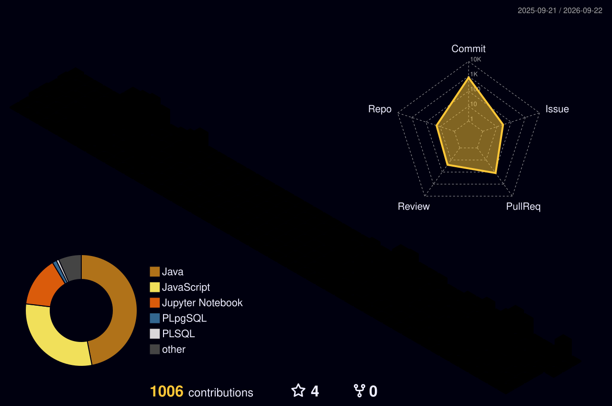

<!--
**ByoungGuk1/ByoungGuk1** is a ✨ _special_ ✨ repository because its `README.md` (this file) appears on your GitHub profile.

Here are some ideas to get you started:

- 🔭 I’m currently working on ...
- 🌱 I’m currently learning ...
- 👯 I’m looking to collaborate on ...
- 🤔 I’m looking for help with ...
- 💬 Ask me about ...
- 📫 How to reach me: ...
- 😄 Pronouns: ...
- ⚡ Fun fact: ...
-->

## 프로젝트 한 줄 소개

1. 10대를 대상으로, 프로그래밍을 처음 접하는 학생들도 부담 없이 들어올 수 있는 서비스
2. 공공데이터를 활용하여 빠르게 응급실에 도착하고빅데이터를 활용하여 간단한 응급처치에 대한 조언을 구할 수 있는 서비스

## 프로젝트 #1

WebNest - 10대를 대상으로, 프로그래밍을 처음 접하는 학생들도 부담 없이 들어올 수 있는 서비스

### 사용 기술

- Language : Java(JDK17), HTML, CSS, JavaScript  
- Server, Cloud : Apache Tomcat 9.0  
- Framework : Spring Boot 3.2.x, React 18.x  
- DB : Oracle 21C, Redis 8.x  
- IDE : IntelliJ IDEA 2025.2.3, Visual Studio Code  
- API, Library : STOMP(WebSocket), Swagger, coolSMS, OpenAI, Monaco Editor, Swiper API, Stream API,OAuth2, Spring Security, JWT  
- DevOps, Tools : Git, GitHub, Docker, Figma, ERDCloud  

### 내 역할 (팀장)

1. 로그인, 회원가입 구현  
2. OAuth2 소셜로그인 구현  
3. JWT 인증  
4. Redis refresh token 관리 
5. OpenAI API 연동 
6. WebSocket/STOMP 끝말잇기 
    
   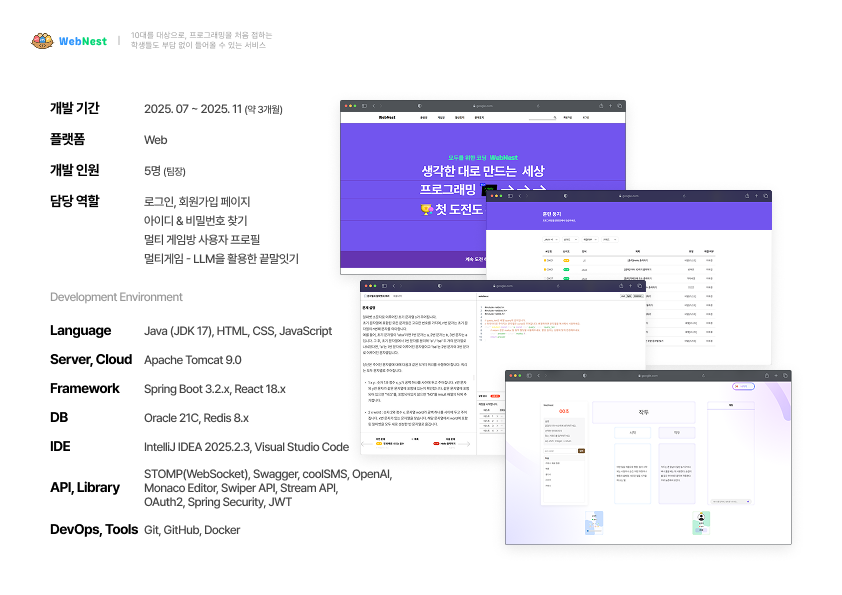

### 핵심 기능

멀티게임 - LLM을 활용한 끝말잇기

### 트러블슈팅 #1

- 상황
  LLM 사용 시 데이터를 가져오지 못했는데에도 다음 코드가 실행되는상황

- 해결 방법
  Map을 통한 Cash 변수를 생성하여 값을 저장했습니다.
  최대 3번까지 요청하며, 필요한 값인 단어와 설명 부분을Cash에 저장합니다.값을 정확하게 가지고 왔다면 설명을 바로 리턴해주고,
  값을 가져오지 못한 경우 확인을 위해 문자열 메세지를 바로 응답해 주었습니다.

- 해당 경험을 통해 알게된 점
  API 사용 시 정해진 요청 경로에 정해진 요청 값을 정해진 타입으로요청해야 하고, 응답을 받는 경우에도 정해진 이름과 타입으로 응답을받아야 한다는 것을 알았습니다.
  이전 OAuth2.0의 경우와 마찬가지로 값이 응답되기 전에 다음 로직을실행시켜버리는 비동기 문제가 발생 할 수 있기에 그 부분도 유의하며로직을 작성해야했습니다.
  따라서 API를 사용할 경우, 요청을 위한 객체와 응답을 위한 객체, 두가지가 필요하다는 것을 알게 되었습니다.

### 트러블슈팅 #2

- 상황
  소셜 회원 가입 시 기본 입력값이 정확하게 VO로 전달되지 않는 상황

- 해결방법
  OAuth2.0를 통해 들어오는 값을 데이터베이스에 저장하기 위해 만든 VO에 저장할 때,
  닉네임 또는 Provider 이름을 사용하여 중복되지 않는 임의의 값을 저장해두었습니다.
  그 후 데이터베이스에 사용자 등록을 마친 다음 바로 로그인이 적용되도록 해주었습니다.

- 해당 경험을 통해 알게된 점
  OAuth2.0의 경우 모든 사이트의 값이 동일한 값으로 전달되는 것이 아닌, 각 사이트에 정해진 이름으로 값을 전달해 주었습니다.
  또한, 값을 전달받는 즉시 이름을 바꿔 저장하는 경우,비동기 문제가 발생하여 값이 제대로 저장되지 않을 수 있다는 것을 알게 되었습니다.
  이를 통해 추후 값을 요청하고 응답하는 경우, 해당 로직이 동기적인지 비동기적인지 한차례 더 생각하게 되는 계기가 되었습니다.

### 간략 시스템 구성도

 
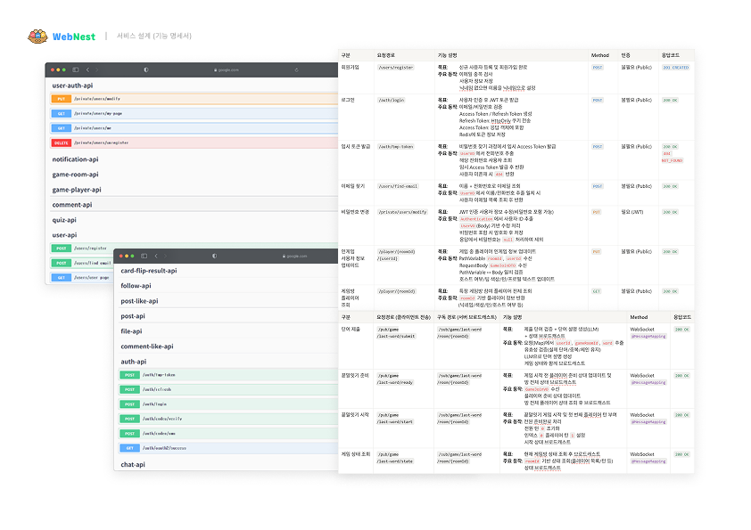

### 끝말잇기

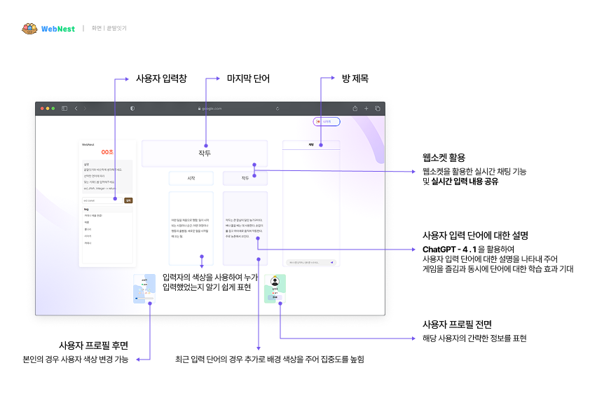

### 로그인 화면

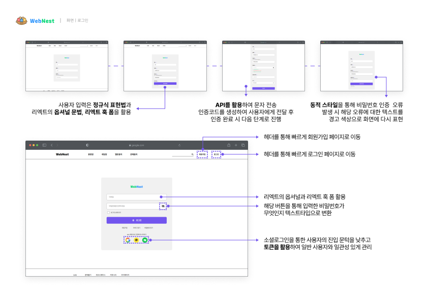

### ID/PW 찾기

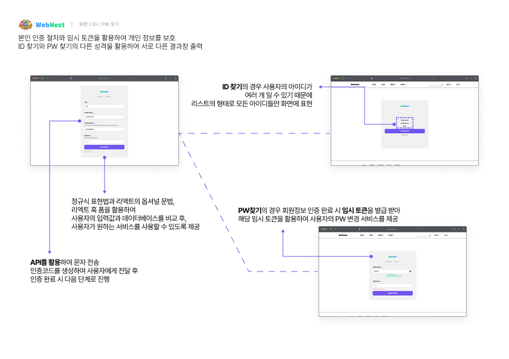

## 프로젝트 #2

EV119 - 공공데이터를 활용하여 빠르게 응급실에 도착하고빅데이터를 활용하여 간단한 응급처치에 대한 조언을 구할 수 있는 서비스

### 사용 기술

- Language : Java(JDK17), HTML, CSS, JavaScript  
- Server, Cloud : Apache Tomcat 9.0  
- Framework : Spring Boot 3.2.x, React 18.x  
- DB : Oracle 21C, Redis 8.x  
- IDE : IntelliJ IDEA 2025.2.3, Visual Studio Code  
- API, Library : JPA, OAuth2, Spring Security, JWT, OpenAI,카카오 맵 API, 응급실 정보 API , 외상센터 정보 API, ... 
- DevOps, Tools : Git, GitHub, Docker, Figma, ERDCloud  

### 내 역할

1. 마이페이지 - 회원정보 수정, 비밀번호 변경  
2. 마이페이지 - 건강정보 조회 및 관리  
3. 마이페이지 - 과거 병원 방문이력  
4. 마이페이지 - 회원 탈퇴  

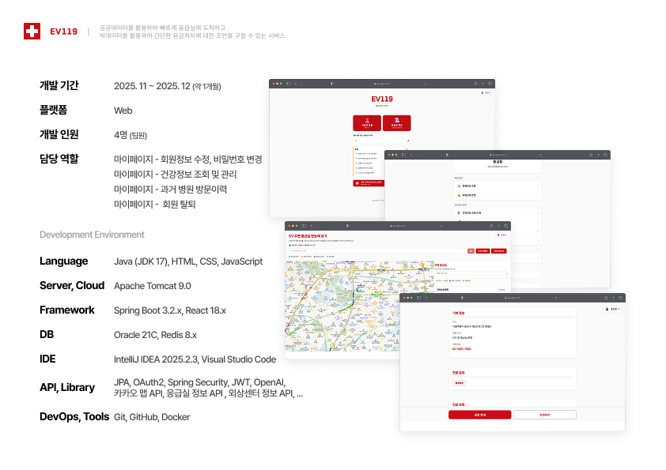

### 핵심 기능

입력된 사용자의 정보를 활용하여 응급 상황 발생시 적절한 조치 방법를 제공

### 간략 시스템 구성도

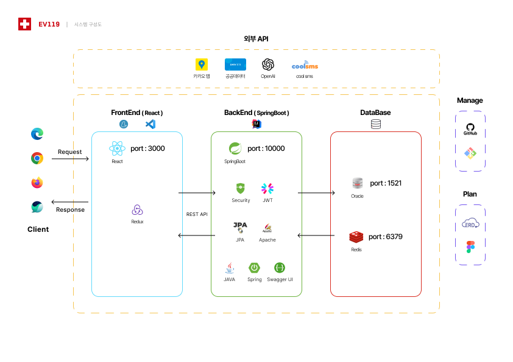

### 데이터베이스 구조

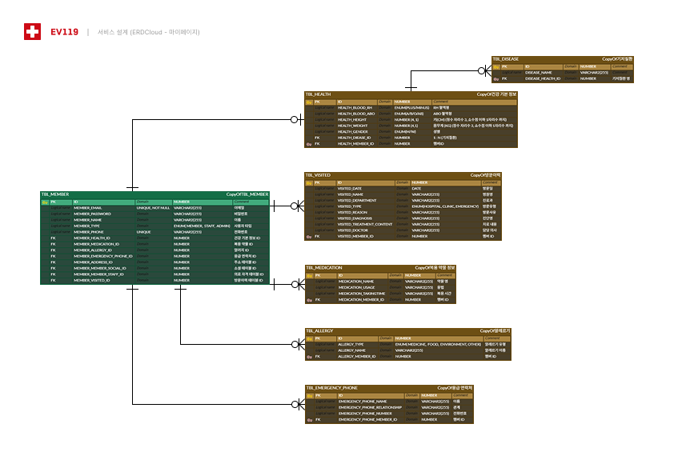

### 기능명세서

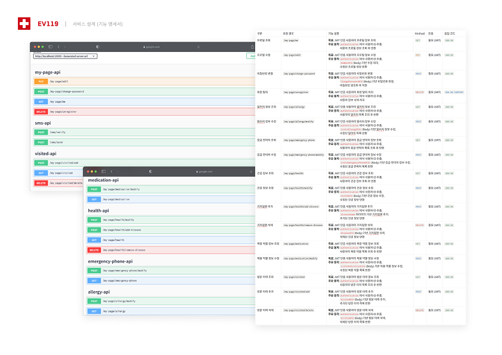

### UI/UX 가이드

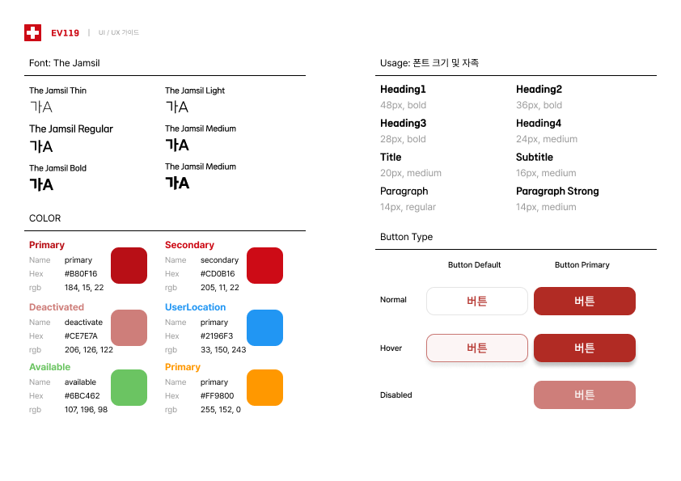

### 계정관리

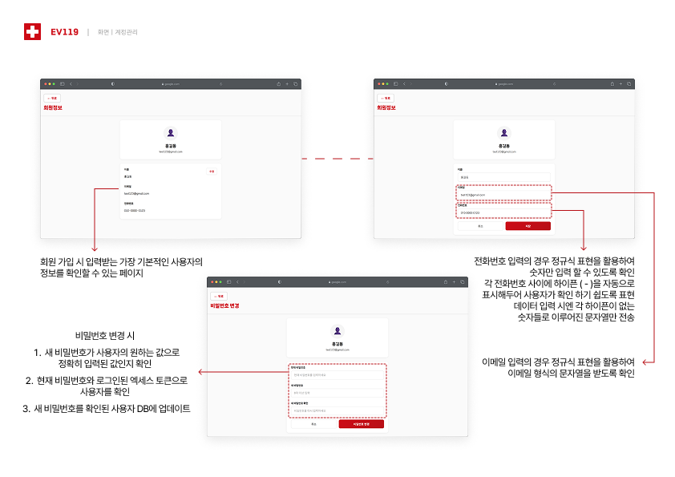

### 건강정보관리

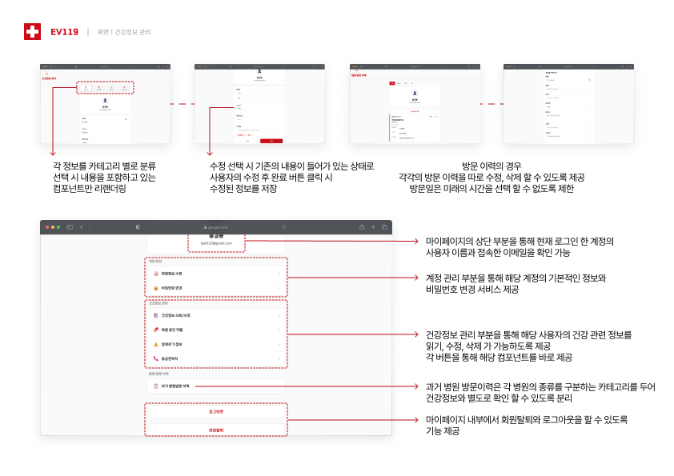
