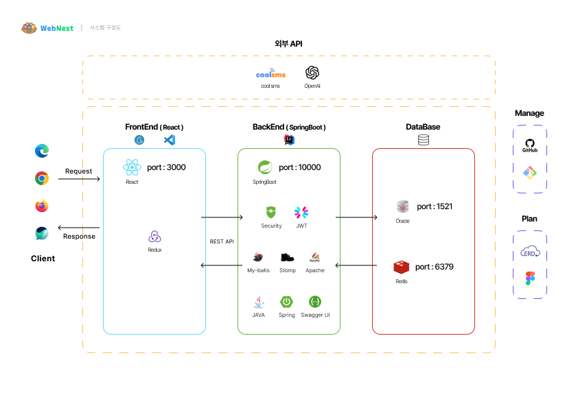

## Profile

🧑 **Name** | SongByoungGuk  
📧 **Email** | bksong121212@gmail.com  

정상 흐름을 구현하는 데서 멈추지 않고, **데이터 정합성·동시성·재처리·멱등성**까지 고려하는 Java/Spring 백엔드 개발자입니다.

## Tech

- ⚙️ Backend | Java 17, Spring Boot, Spring MVC, Spring Security, Spring Batch, JPA/Hibernate, MyBatis
- 🗄️ Data | MariaDB, Oracle, MySQL, PostgreSQL, Redis
- 🔗 API / Integration | REST API, JWT, OAuth2, Swagger/OpenAPI, WebSocket/STOMP
- 🎨 Frontend | React, JavaScript, TypeScript, Thymeleaf, jQuery
- 🧪 Test / Infra | JUnit 5, Mockito, AssertJ, MockMvc, H2, Docker, Git/GitHub

## Links

- 💼 **Portfolio** | <a href="pdf/포트폴리오/종합.pdf">Portfolio (PDF)</a>
- 📄 **Notion** | https://www.notion.so/2b71ad5726a880249391e9c062cc1f53?source=copy_link  
- 💻 **Velog** | https://velog.io/@bksong9903  

## Team Projects

### MARIA | RIA 국내시장복귀계좌 관리 시스템

- Repository: [returns-7/maria](https://github.com/returns-7/maria)
- Period/Team: 2026.07~2026.08 · 5명
- Role: Account·Settlement 도메인, MyData 계좌 동기화 흐름
- Key Topics: CAS, Redis ZSET Retry Queue, Ownership Token, Spring Batch, REQUIRES_NEW, Append-only Retry
- Stack: Java 17, Spring Boot 3.5.16, Spring Security, MyBatis, MariaDB, Redis, Spring Batch, Scheduler/Async, Thymeleaf

### WebNest | 알고리즘 학습·커뮤니티

- Repository: [Frontend](https://github.com/NullPoint-team/WebNest_front) | [Backend](https://github.com/NullPoint-team/WebNest_back)
- Period/Team: 2025.07~2025.11 · 5명 · 팀장
- Role: 인증·회원 백엔드, API 연동 기준, WebSocket/STOMP·LLM 기능
- Stack: Java 17, Spring Boot 3.5.7, Spring Security, JWT, OAuth2, MyBatis, Oracle, Redis, React 19

### EV119 | 응급·건강 정보 관리 플랫폼

- Repository: [Frontend](https://github.com/evee-EV119/EV119-react) | [Backend](https://github.com/evee-EV119/EV119-spring)
- Period/Team: 2025.11~2025.12 · 4명
- Role: 마이페이지, 건강정보·복용 약·알레르기·긴급 연락처 API
- Stack: Java 17, Spring Boot 3.5.0, Spring Security, JWT, JPA/Hibernate, QueryDSL, Oracle, Redis, React 19

## Project Details

<strong>팀 프로젝트 · MARIA Account/Settlement 상세 보기</strong>

### 프로젝트 개요

- RIA 계좌 심사부터 해외주식 입고·매도·가환전·확정산·세제혜택까지 처리하는 증권사 백오피스
- MARIA, MyData(PostgreSQL), Return Securities가 DB를 공유하지 않고 REST API로 통신하는 다중 시스템 구조
- Account 도메인과 Settlement 도메인, MyData 계좌 동기화 흐름 담당

### Account

- 고객별 1계좌, 계좌번호 중복 방지, 5천만 원 합산 한도와 상태 전이를 서비스 검증과 DB 제약으로 이중 방어
- `expectedCurrentLimit`를 조건으로 포함한 Compare-And-Set 방식으로 동시 한도 변경의 Lost Update 감지
- APPLIED·OPENED·REJECTED 상태 전이와 재신청을 조건부 UPDATE로 제한하고, 상태·혜택·관리자 감사 이력을 현재 상태와 분리해 저장
- DB Commit 후 MyData 동기화 실패를 Redis ZSET Retry Queue에 예약하고 1분·5분·15분·1시간 단계형 Backoff로 재처리
- `lockToken`과 `taskToken`을 분리하고 Lua Script에서 비교·삭제·재예약을 원자적으로 수행해 오래된 Worker의 상태 덮어쓰기 차단

### Settlement

- 매도 체결 트랜잭션에 `Propagation.MANDATORY`로 가환전을 참여시켜 매도만 남고 가환전이 누락되는 중간 상태 방지
- Guard Row `SELECT FOR UPDATE`와 `runId`로 동일 업무일의 중복 Batch 생성과 오래된 비동기 Job 실행 차단
- `ExecutionContext`에 커서를 저장하고 Keyset Pagination으로 PENDING Item을 100건씩 처리
- Item별 `REQUIRES_NEW` 독립 트랜잭션으로 성공 건을 보존하고 실패 건만 기록·재처리
- 기존 실패 행을 수정하지 않고 새 Item을 추가하는 Append-only Retry와 `FINALIZED` 재확인으로 추적성·멱등성 확보
- Batch 통계는 같은 Batch·Exchange의 가장 최근 Item을 현재 결과로 집계해 재처리 이력과 현재 상태를 구분
- 환율 API를 DB 트랜잭션 밖에서 조회하고, 같은 Batch 내 동일 통화·기준일의 정상·실패 결과를 `ExecutionContext`에서 공유
- 환율 데이터가 없는 경우 이전 날짜 탐색을 공통 Client에 일임해, 동일 조건 Item이 여러 건이어도 Batch 전체 외부 조회를 최대 8회로 제한

### 설계 한계와 개선 방향

- DB Commit과 Redis Task 등록 사이의 Dual Write 구간은 Transactional Outbox 도입 후보
- Lock Watchdog·Lease 연장, Testcontainers 기반 장애 주입, Retry 운영 지표는 후속 개선 과제

---

<strong>팀 프로젝트 #1 · WebNest 상세 보기</strong>

## 팀 프로젝트 #1

WebNest - 10대를 대상으로, 프로그래밍을 처음 접하는 학생들도 부담 없이 들어올 수 있는 서비스

### 사용 기술

- Backend: Java 17, Spring Boot 3.5.7, Spring Security, OAuth2 Client, MyBatis  
- Data: Oracle 21C, Redis  
- Frontend: React 19, JavaScript, Redux, styled-components  
- Integration: JWT, WebSocket/STOMP, OpenAI API, Swagger/OpenAPI  
- Tools: Git, GitHub, Docker, Figma, ERDCloud  

### 내 역할 (팀장)

1. Spring Security·JWT 기반 로그인·회원가입 및 Access/Refresh Token 분리  
2. Google·Naver·Kakao OAuth2 응답을 내부 회원·소셜 계정 모델로 변환  
3. Redis에 Refresh Token과 OAuth2 일회성 교환 Key 저장  
4. OpenAI API 단어 설명 기능과 로컬 Cache·재시도·Fallback 처리  
5. WebSocket/STOMP 기반 방 단위 끝말잇기 메시지 처리  
6. GitHub Organization·브랜치·일정·공통 API 연동 기준 관리  
    
   

### 핵심 기능

멀티게임 - LLM을 활용한 끝말잇기

### 트러블슈팅 #1 · LLM 응답 실패와 반복 호출

- 문제: 동일한 단어 설명이 반복 요청되고, 응답 구조가 비어 있거나 429·5xx·네트워크 오류가 발생할 때 후속 로직이 정상 결과를 가정할 수 있었습니다.
- 해결: `ConcurrentHashMap`에 단어별 설명을 캐시하고, `choices→message→content`를 단계적으로 검증했습니다. 재시도 가능한 오류는 최대 3회 재요청하고, 최종 실패 시 고정된 Fallback 메시지를 반환했습니다.
- 결과: 반복 외부 호출을 줄이고, 부분 응답과 외부 API 장애를 정상 결과와 분리했습니다.

### 트러블슈팅 #2 · OAuth2 Provider별 응답 차이

- 문제: Google·Naver·Kakao가 사용자 정보를 서로 다른 중첩 구조와 키 이름으로 제공하고, Kakao는 동의 상태에 따라 이메일을 제공하지 않을 수 있었습니다.
- 해결: Provider별로 email·name·providerId를 추출해 내부 회원 모델로 표준화했습니다. 이메일이 없으면 `provider + providerId`로 기존 연결 계정을 찾고, 찾지 못하면 이메일 동의 화면으로 분기했습니다.
- 결과: 외부 Provider의 응답 차이를 내부 회원·소셜 계정 모델에서 흡수하고, 재로그인·신규 가입·추가 동의 흐름을 분리했습니다.

### 간략 시스템 구성도

### 끝말잇기

### 로그인 화면

### ID/PW 찾기

<strong>팀 프로젝트 #2 · EV119 상세 보기</strong>

## 팀 프로젝트 #2

EV119 - 공공데이터를 활용하여 빠르게 응급실에 도착하고 빅데이터를 활용하여 간단한 응급처치에 대한 조언을 구할 수 있는 서비스

### 사용 기술

- Backend: Java 17, Spring Boot 3.5.0, Spring Security, JPA/Hibernate, QueryDSL  
- Data: Oracle 21C, Redis  
- Frontend: React 19, JavaScript, Redux, styled-components  
- Integration: JWT, OAuth2, Swagger/OpenAPI, Kakao Map, 응급실·외상센터 공공 API  
- Tools: Git, GitHub, Docker, Figma, ERDCloud  

### 내 역할

1. 마이페이지 회원정보 조회·수정과 비밀번호 변경  
2. 혈액형·신장·체중·질환 등 건강정보 조회·수정  
3. 복용 약·알레르기·긴급 연락처·과거 병원 방문이력 API  
4. 회원 탈퇴 시 연관 Entity의 FK 의존 관계와 삭제 순서 처리  

### 프로젝트 핵심 기능

입력된 사용자의 정보를 활용하여 응급 상황 발생 시 적절한 조치 방법 제공

### 트러블슈팅 · 회원 탈퇴 시 FK 제약조건 오류

- 문제: 회원을 먼저 삭제하면 건강·질환·복용 약·알레르기·긴급 연락처·방문이력 등의 연관 데이터로 인해 Oracle FK 제약조건 오류가 발생했습니다.
- 해결: Entity 연관관계와 SQL 로그를 따라 의존 데이터를 파악하고, 자식 데이터부터 삭제한 뒤 `flush()`로 SQL 실행 순서를 보장하고 마지막에 회원을 삭제했습니다.
- 결과: 회원 탈퇴를 하나의 트랜잭션으로 처리하면서 FK 제약조건을 지키는 삭제 순서를 명시했습니다.

### 간략 시스템 구성도

### 데이터베이스 구조

### 기능명세서

### UI/UX 가이드

### 계정관리

### 건강정보관리

